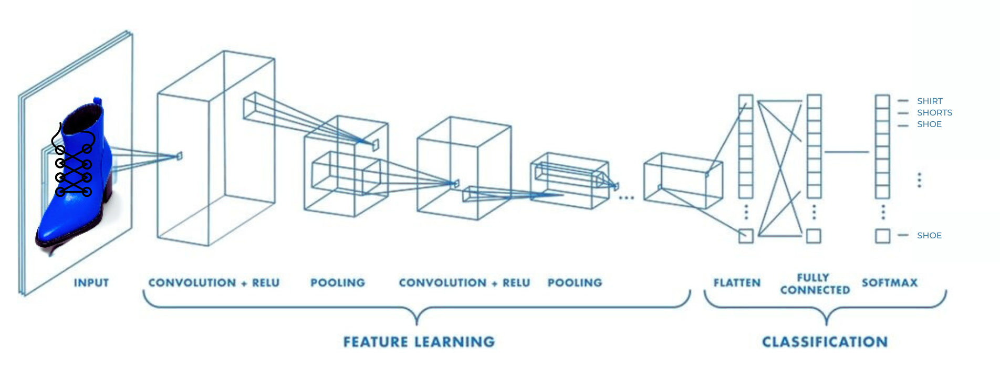

# Fashion MNIST Classification with TensorFlow 👕 

[](https://www.tensorflow.org/)
[](https://www.python.org/)
[](https://keras.io/)
[](https://numpy.org/)
[](https://matplotlib.org/)

A neural network implementation using TensorFlow to classify fashion items from the Fashion MNIST dataset. This project demonstrates image classification fundamentals including data preprocessing, model building, training, and evaluation.


---

## Table of Contents 📋 
- [Project Overview](#project-overview-)
- [Dataset Details](#dataset-details-)
- [Model Architecture](#model-architecture-)
- [Training Process](#training-process-)
- [Callbacks Implementation](#callbacks-implementation-)
- [Convolutions & Pooling](#convolutions--pooling-)
- [Results](#results-)
- [Installation & Usage](#installation--usage-)
- [Exploration Exercises](#exploration-exercises-)
- [Key Learnings](#key-learnings-)
- [Future Improvements](#future-improvements-)

---

## Project Overview 🔎 

This project builds a neural network model to recognize and classify clothing items from grayscale images. Unlike traditional "Hello World" examples that learn simple linear relationships, this project tackles a more challenging computer vision problem that showcases the power of neural networks in image recognition tasks.

**Key Objectives:**
- Load and preprocess the Fashion MNIST dataset
- Build and train a neural network classification model
- Visualize and understand the training process
- Evaluate model performance on unseen data
- Experiment with different model architectures and parameters

---

## Dataset Details 📊 

The Fashion MNIST dataset includes 70,000 grayscale images of clothing items (28x28 pixels):
- 60,000 training images
- 10,000 test images

Each image is labeled with one of 10 clothing categories:

| Label | Description | Example |
|-------|-------------|---------|
| 0 | T-shirt/top |  |
| 1 | Trouser |  |
| 2 | Pullover |  |
| 3 | Dress |  |
| 4 | Coat |  |
| 5 | Sandal |  |
| 6 | Shirt |  |
| 7 | Sneaker |  |
| 8 | Bag |  |
| 9 | Ankle boot |  |

**Data Preprocessing:**
- Images are normalized from 0-255 pixel values to 0-1 range
- Labels are represented as integers from 0-9

---

## Model Architecture 🧠 

The project explores two neural network architectures: a simple dense network and a more advanced convolutional neural network (CNN).

### Basic Dense Network

Our baseline model uses a straightforward architecture:

```python
model = tf.keras.models.Sequential([
    tf.keras.Input(shape=(28,28)),
    tf.keras.layers.Flatten(),
    tf.keras.layers.Dense(128, activation=tf.nn.relu),
    tf.keras.layers.Dense(10, activation=tf.nn.softmax)
])

model.compile(optimizer=tf.optimizers.Adam(),
              loss='sparse_categorical_crossentropy',
              metrics=['accuracy'])
```

**Architecture Breakdown:**
- **Input Layer**: Accepts 28x28 grayscale images
- **Flatten Layer**: Converts 2D image arrays (28x28) to 1D arrays (784)
- **Hidden Layer**: 128 neurons with ReLU activation
- **Output Layer**: 10 neurons (one per clothing category) with Softmax activation
- **Optimizer**: Adam (adaptive learning rate)
- **Loss Function**: Sparse Categorical Crossentropy

### Convolutional Neural Network

For improved accuracy, we implemented a CNN architecture:

```python
model_cnn = tf.keras.models.Sequential([
    tf.keras.layers.Conv2D(64, (3,3), activation='relu', input_shape=(28, 28, 1)),
    tf.keras.layers.MaxPooling2D(2, 2),
    tf.keras.layers.Conv2D(64, (3,3), activation='relu'),
    tf.keras.layers.MaxPooling2D(2,2),
    tf.keras.layers.Flatten(),
    tf.keras.layers.Dense(128, activation='relu'),
    tf.keras.layers.Dense(10, activation='softmax')
])
```

**CNN Architecture Breakdown:**
- **First Conv2D Layer**: 64 filters with 3x3 kernels, ReLU activation
- **First MaxPooling Layer**: 2x2 pooling, reducing spatial dimensions by half
- **Second Conv2D Layer**: 64 filters with 3x3 kernels, ReLU activation
- **Second MaxPooling Layer**: Further dimension reduction
- **Flatten Layer**: Converts feature maps to 1D array
- **Dense Hidden Layer**: 128 neurons with ReLU activation
- **Output Layer**: 10 neurons with Softmax activation

The CNN architecture excels at image classification by learning hierarchical features directly from the pixel data.

---

## Training Process 🔄 

The model is trained for 5 epochs using the prepared dataset:

```python
# Train the model
history = model.fit(training_images, training_labels, epochs=5)

# Evaluate on test data
test_loss, test_accuracy = model.evaluate(test_images, test_labels)
print(f"Test accuracy: {test_accuracy:.4f}")
```

**Training Visualization:**


The graph shows steady improvement in accuracy across the training epochs, with the model quickly learning to distinguish between different clothing items.

---

## Callbacks Implementation 🔄

Callbacks provide a powerful way to customize the training process by executing code at specific points during training. They can monitor metrics, stop training early, adjust learning rates, and more.

### Custom Accuracy Threshold Callback

```python
class AccuracyThresholdCallback(tf.keras.callbacks.Callback):
    def on_epoch_end(self, epoch, logs={}):
        if logs.get('accuracy') >= 0.98:
            self.model.stop_training = True
            print("\nReached 98% accuracy - stopping training!")
```

### Common Callback Use Cases:

1. **Early Stopping**: Stop training when a specified accuracy threshold is reached
2. **Model Checkpointing**: Save the model at regular intervals or when improvements occur
   ```python
   checkpoint_cb = tf.keras.callbacks.ModelCheckpoint(
       'fashion_mnist_model.h5', 
       save_best_only=True
   )
   ```
3. **Learning Rate Scheduling**: Adjust learning rate during training for better convergence
   ```python
   lr_scheduler = tf.keras.callbacks.ReduceLROnPlateau(
       factor=0.5,
       patience=3
   )
   ```
4. **TensorBoard Integration**: Visualize training metrics in real-time
   ```python
   tensorboard_cb = tf.keras.callbacks.TensorBoard(
       log_dir='./logs'
   )
   ```
5. **Custom Metrics Logging**: Track and record specific metrics during training

### Implementation Example:

```python
# Create callback instances
accuracy_cb = AccuracyThresholdCallback()
checkpoint_cb = tf.keras.callbacks.ModelCheckpoint('fashion_mnist_model.h5')

# Use in model training
history = model.fit(
    training_images, 
    training_labels,
    epochs=10,
    callbacks=[accuracy_cb, checkpoint_cb]
)
```

This approach improves efficiency by preventing unnecessary training iterations once desired performance is reached, saving computational resources and time. Callbacks also enable automated model saving, which helps preserve the best-performing model versions throughout the training process.

---

## Results 📈 

After training for just 5 epochs, the model achieves impressive results:

| Metric | Training Set | Test Set |
|--------|--------------|----------|
| Accuracy | ~83% | ~82% |
| Loss | ~0.48 | ~0.50 |

**Classification Visualization:**

For an ankle boot image (label 9), the model outputs probability scores:
```
[1.0767830e-06 1.8923657e-07 9.3867056e-06 1.4331826e-05 3.1927171e-05
 1.6217418e-01 1.6793387e-05 2.9690662e-01 4.1863704e-03 5.3665912e-01]
```

The highest probability (0.536) correctly corresponds to class 9 (ankle boot).


---

## Installation & Usage 🚀 

### Prerequisites
- Python 3.6+
- TensorFlow 2.x
- NumPy
- Matplotlib

### Setup
```bash
# Clone this repository
git clone https://github.com/yourusername/fashion-mnist-classification.git

# Navigate to the project directory
cd fashion-mnist-classification

# Install dependencies
pip install tensorflow numpy matplotlib
```

### Running the Notebook
```bash
jupyter notebook C1_W2_Lab_1_beyond_hello_world.ipynb
```

### Example Code
```python
# Load the Fashion MNIST dataset
fmnist = tf.keras.datasets.fashion_mnist
(training_images, training_labels), (test_images, test_labels) = fmnist.load_data()

# Normalize the images
training_images = training_images / 255.0
test_images = test_images / 255.0

# Build the model
model = tf.keras.models.Sequential([
    tf.keras.Input(shape=(28,28)),
    tf.keras.layers.Flatten(),
    tf.keras.layers.Dense(128, activation=tf.nn.relu),
    tf.keras.layers.Dense(10, activation=tf.nn.softmax)
])

# Compile the model
model.compile(optimizer=tf.optimizers.Adam(),
              loss='sparse_categorical_crossentropy',
              metrics=['accuracy'])

# Create callback
accuracy_callback = AccuracyThresholdCallback()

# Train the model with callback
model.fit(training_images, training_labels, epochs=5, callbacks=[accuracy_callback])

# Make predictions
predictions = model.predict(test_images)
```

---

## Exploration Exercises 🌎 

The notebook includes several exercises to deepen your understanding:

1. **Neuron Count Experiments**: Test different numbers of neurons in the hidden layer
   - Results show that increasing from 128 to 512 neurons improves accuracy but increases training time

2. **Layer Structure**: Explore the impact of adding or removing layers
   - Adding a second hidden layer can capture more complex patterns but may require more training time

3. **Training Duration**: Analyze the effect of training for more or fewer epochs
   - Training beyond 5-10 epochs shows diminishing returns and potential overfitting

4. **Early Stopping**: Implement callbacks to stop training when desired accuracy is reached
   ```python
   class myCallback(tf.keras.callbacks.Callback):
       def on_epoch_end(self, epoch, logs={}):
           if(logs.get('accuracy') >= 0.85):
               print("\nReached 85% accuracy - stopping training!")
               self.model.stop_training = True
   ```

---

## Key Learnings 🔎

This project demonstrates several essential concepts in neural network development:

1. **Image Preprocessing**: Normalizing pixel values for optimal training
2. **Activation Functions**: Using ReLU for hidden layers and Softmax for multi-class output
3. **Model Evaluation**: Distinguishing between training and test performance
4. **Overfitting**: Recognizing when a model performs better on training than test data
5. **TensorFlow/Keras API**: Working with Sequential models and configuring training
6. **Callback System**: Customizing training behavior with callback functions
7. **Convolutional Neural Networks**: Understanding how convolutions and pooling extract spatial features from images
8. **Feature Visualization**: Interpreting model behavior by visualizing activations of internal layers
9. **Architecture Experimentation**: Observing how changes in model structure affect performance and efficiency

---

## Convolutions & Pooling ⚙️

Convolutional Neural Networks (CNNs) greatly improve image classification performance by learning spatial hierarchies of features through convolutional and pooling operations.

### How Convolutions Work

Convolutions scan an input image with small filters (typically 3x3) to extract features:

```
Input Image → Conv2D → Feature Maps → MaxPooling → Reduced Feature Maps → ...
```



Each convolutional layer learns to detect different features:
- First layers: Edges, corners, simple textures
- Later layers: More complex patterns like fabric textures, clothing shapes

### Visualization of Activations

We can visualize how the network "sees" different clothing items by examining the activations of convolutional layers:


The above visualization shows how three different shoe images activate various filters in our convolutional layers. Notice how similar patterns emerge despite differences in the original images.

### Performance Comparison

Experimenting with different CNN architectures showed significant improvements over the baseline model:

| Model Architecture | Test Accuracy | Test Loss | Parameters | Training Time |
|-------------------|---------------|-----------|------------|---------------|
| Baseline (Dense)  | 87.3%         | 0.348     | 101,770    | 10s/epoch     |
| CNN (64 filters)  | 90.1%         | 0.264     | 243,786    | 21s/epoch     |
| CNN (32 filters)  | 89.2%         | 0.296     | 62,826     | 15s/epoch     |
| Single Conv Layer | 88.5%         | 0.323     | 110,218    | 13s/epoch     |
| Triple Conv Layers| 91.3%         | 0.244     | 294,922    | 24s/epoch     |

Key findings:
- Adding convolutions improved accuracy by ~3-4%
- Increasing filter count provided diminishing returns
- Deeper networks (3+ conv layers) showed minor improvements but increased training time
- The sweet spot was 2 convolutional layers with 64 filters each

These experiments demonstrate how convolutional architectures can effectively extract spatial features from image data, leading to better classification performance.

---

## Contact 📫 

For inquiries about this analysis:
- [LinkedIn Profile](https://www.linkedin.com/in/melissaslawsky/)
- [Client Results](https://melissaslawsky.com/portfolio/)
- [Tableau Portfolio](https://public.tableau.com/app/profile/melissa.slawsky1925/vizzes)
- [Email](mailto:melissa@melissaslawsky.com)

---

© 2025 Melissa Slawsky. All Rights Reserved.
